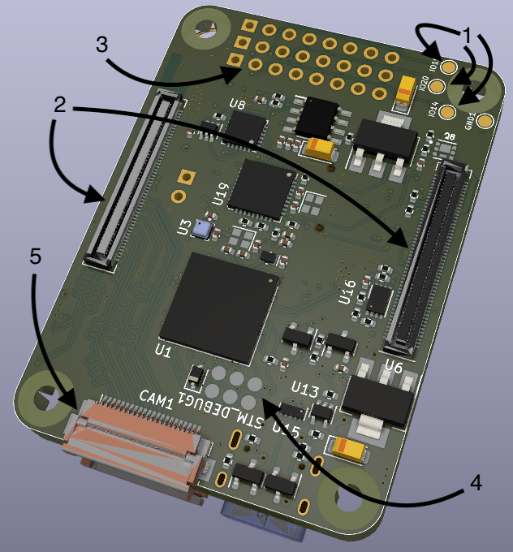
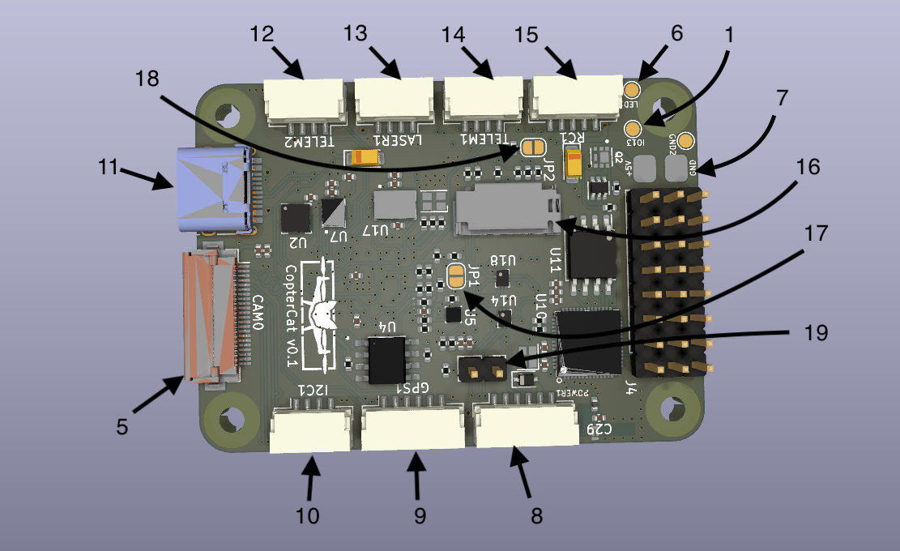

# CopterCat_cm4

Полётный контроллер для стандарта FMU-v6u. Обычно на дронах для программирования устанавливают полётный контроллер, одноплатный компьютер и иногда arduino. Почему бы не объединить это в одну плату (ну или компактный стек), это уменьшит габариты и вес. В качестве arduino мы выбрали чип ESP32, это позволит организовывать из нескольких подобных плат одну независимую сеть для коммуникации между дронами.

## Спецификация 

### FMU
* STM32H753IIK6 480Mhz Cortex-M7
* 2Mb + 256Kb FLASH
* 1Mb RAM
* ICM20602, ICM42605, BMI088, BMP388, BMM150
* Полностью совместима со стандартом FMU-v6u
### Raspberry Pi
* Поддержка платы RPi CM4 
* Слот для SD-карты
* Возможность прошивки встроенной eMMC
* CAT24C256 EEPROM
* Поддержка 2 камер(CAM0-две линия, CAM1-четыре линии)
* Поддержка USB-OTG
### ESP32
* 16MB внешней FLASH (W25Q128JVS)
* 8MB внешней PSRAM (LY68L6400SLIT)
* Встроенная антенна
* USB-TTL конвертор
### Остальное
* USB-HUB USB2514B
* USB-PD с физическим переключением
* Связь ESP32 и STM32 через UART
* 3 варианта питания
* 4 универсальных GPIO от ESP32
* USB Type-C
* Размеры 40x55 мм, плата 4 слоя
___

## Разьёмы и перемычки

1. GPIO ESP32 4 порта ввода вывода для подключения внешнего оборудования
2. Коннекторы RPi CM4
3. Выводы ESC 8 шт
4. Контакты программирования и отладки JTAG STM32
5. Коннекторы камер (шлейф 22 контакта с 0.5 мм расстояния между проводниками)
6. Контакт подключения адресной ленты
7. Контакты основного питания 5В
8. JST-6 стандартного шлейфа питания PX4 
9. JST-6 GPS+компас+5В
10. JST-4 I2C+5В
11. USB Type-C
12. JST-4 UART7+5В
13. JST-4 I2C RPi+3.3B для подключения дальномера
14. JST-4 UART5+5В
15. JST-5 Стандартный разъём для подключения приёмника управления
16. Слот SD карты (для RPi)
17. Джампер BOOT для STM32
18. Джампер RPIBOOT для прошивки eMMC модуля RPi CM4
19. Джампер переключения режима работы USB разъёма (при замкнутой перемычке, USB работает как вход HUB и при подключении к компьютеру будут отборажаться STM32, ESP32 и RPi CM4 в режиме OTG; при разомкнутой перемычке, USB будет работать для подключения внешних устройств к RPi, например стерео-камеры)
___

## Загрузка прошивки
### FMU
При первом запуске, в микроконтреллер придётся загрузить PX4-bootloader через порт JTAG. Подробная инструкция [здесь](https://docs.px4.io/master/en/software_update/stm32_bootloader.html#stm32-bootloader).

Для подключения к компьютеру:
1. Замкните перемычку 19
2. Подключите USB Type-C к компьютеру
3. Устройство должно появиться в [QGC](http://qgroundcontrol.com)

Также прошивку можно произвести через RPi:
1. Установите RPi CM4 в коннектор на плате
2. Разомкните перемычку 19
3. Устройство появиться в папке /dev на RPi

### ESP32
Написать программу можно либо в [Arduino IDE](https://www.arduino.cc/en/software), либо в [VS Code](https://code.visualstudio.com) с плагином [esp-idf](https://habr.com/ru/post/530638/). Далее скомпилировать и загрузить в микроконтроллер. Загрузить можно двумя способами.

С компьютера:
1. Замкните перемычку 19
2. В подключённых устройствах появиться CP2104
3. Загрузите прошивку в соотвествии с инструкцией к выбранной IDE

С RPi CM4:
1. Установите RPi CM4 в коннектор на плате
2. Разомкните перемычку 19
3. Скомпилируйте ваш код в .bin формат
4. Загрузите полученный файл на RPi
5. Загрузите прошивку в микроконтроллер с помощью esptool.py ([описание+установка](https://docs.espressif.com/projects/esptool/en/latest/esp32/index.html))

Так же ESP32 подключен к STM32 по UART, это позволит связывть между собой не просто RPi, а сразу FMU.

### RPi CM4
Слот SD карты работает как на стандартной RPi. Для плат с eMMC порядок загрузки операционной системы не отличается от CM4 IO Board ([инструкция](https://www.jeffgeerling.com/blog/2020/how-flash-raspberry-pi-os-compute-module-4-emmc-usbboot)).

___

## Общая информация
* Все требуемые для заказа файлы находится в папке /gerbers.
* Проект выполнен в программе [KiCAD v6](https://www.kicad.org)
* Библиотеки компонентов взяты с сайта [snapeda](https://www.snapeda.com)
